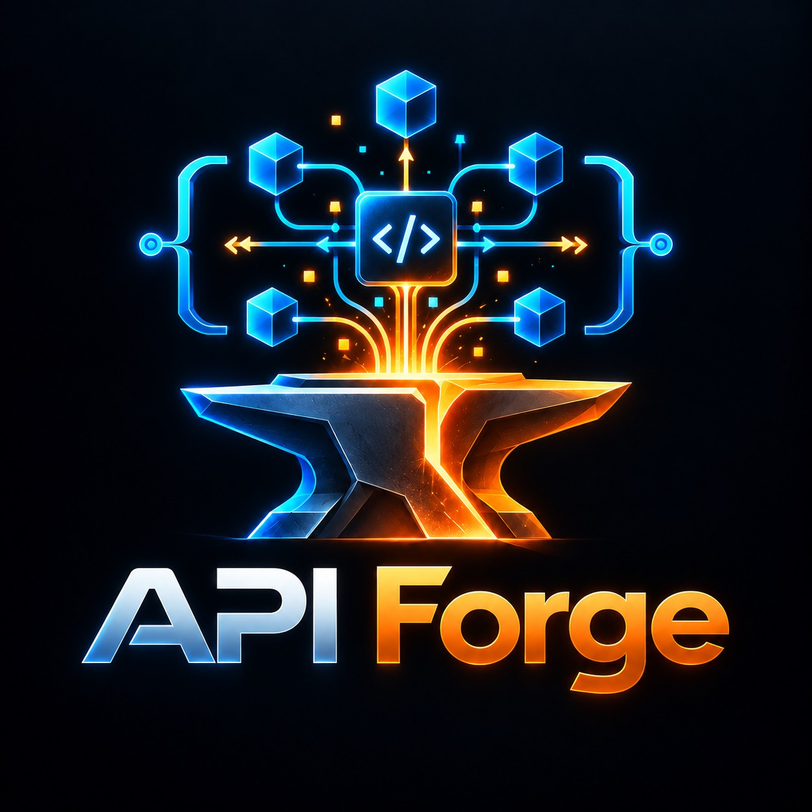

<p align="center">
  
</p>

<h1 align="center">API Forge</h1>

<p align="center">Engenharia de APIs determinística, offline-first e local-first.</p>

O API Forge cobre descoberta, construção, evolução, migração, contratos, gRPC,
testes, performance, observabilidade, acesso a dados e execução governada de
agentes — sempre com evidência, contratos e decisões reproduzíveis.

[English README](README.md) · [Índice de documentação](docs/README.pt-BR.md) · [Documentation index in English](docs/README.md) · [Guia portátil em português](docs/guides/API_FORGE_PORTABLE_DISTRIBUTION.pt-BR.md) · [Portable guide in English](docs/guides/API_FORGE_PORTABLE_DISTRIBUTION.md)

## Instalação sem administrador

```powershell
uv venv E:\tools\api-forge-env
E:\tools\api-forge-env\Scripts\python.exe -m pip install 'apiforge[all]'
$env:PATH = "E:\tools\api-forge-env\Scripts;$env:PATH"
```

```bash
uv venv "$HOME/.local/share/api-forge-env"
"$HOME/.local/share/api-forge-env/bin/python" -m pip install 'apiforge[all]'
export PATH="$HOME/.local/share/api-forge-env/bin:$PATH"
```

Se o local padrão não for gravável:

```text
APIFORGE_HOME   estado do usuário
APIFORGE_CONFIG configuração opcional
APIFORGE_CACHE  cache local
```

## Passo a passo rápido

```text
apiforge inspect
apiforge doctor
apiforge init
apiforge status
apiforge context resolve --scope repo
```

Para repositórios independentes:

```text
apiforge workspace init --root <workspace> --name platform
apiforge workspace add <repo> --root <workspace>
apiforge workspace status --root <workspace>
apiforge context resolve --root <workspace> --scope workspace
```

Os escopos de contexto são `repo`, `workspace` e `target`; o impacto pode ser
`direct`, `transitive` ou `all`. O projeto consumidor recebe apenas manifests
mínimos; agents, skills, knowledge e templates permanecem na instalação.

### Roteamento adaptativo entregue em três ondas

O programa de roteamento adaptativo está concluído e disponível no core
portátil e sem host:

- Onda 1 adiciona `RoutingPlan/v1` com papéis explícitos de primary, fallback,
  paralelo, reviewer, critic e referee.
- Onda 2 adiciona scorecards multidimensionais, sinais com frescor, receipts
  para observações e um gate opcional de avaliação adversarial.
- Onda 3 adiciona expertise packs locais versionados, roteamento por
  família/implementação e recusa explícita quando o conhecimento local exigido
  não está disponível.

As runs preservam `routing.json` para a decisão compatível e
`routing-plan.json` para o plano de execução bounded. As três ondas não exigem
host, rede, SDK de modelo ou mutação externa. O mapa de evolução registra os
itens pós-ship ainda adiados, incluindo orquestração de alto nível com
`ask`/`improve`/`migrate`/`fix`, inferência completa de relações, atualização
remota de Knowledge Packs, instalação por symlink, overwrite automático de
arquivos de host, precedência por task, debate distribuído no workspace e
paridade total entre hosts.

### Extensões atuais de roteamento adaptativo: A, B e C

O programa pós-ondas está fechado em três entregas SDD aditivas, offline-first:

- **A — Risk-Aware Routing e Task Complexity:** risco explícito e complexidade
  governam profundidade de verificação, papéis e fallback bounded.
- **B — Scorecard-Adaptive Routing:** scorecards locais frescos fornecem
  evidência bounded de champion/challenger/unresolved sem promoção automática.
- **C — Graph-Aware Impact:** evidência explícita e bounded do grafo adiciona
  gates conservadores de impacto, evidência de seleção e um brief explicável.

A, B e C permanecem aditivos: C não pode reduzir o gate de risco/complexidade
de A nem os gates de evidência de scorecard de B. A avaliação canônica de C é
persistida em `graph-impact.json`; evidências stale, ausentes ou unresolved
continuam visíveis e conservadoras. Consulte o
[contrato GraphImpactAssessment/v1](docs/contracts/GraphImpactAssessment-v1.md)
e o [arquivo de C](.claude/sdd/archive/GRAPH_AWARE_IMPACT/SHIPPED_2026-09-25.md).

## Hosts e MCP

Claude, Codex, Devin, Copilot e MCP são adapters opcionais. Verifique:

```text
apiforge agentops hosts
apiforge agentops parity
apiforge agentops negotiate --capability mcp
apiforge agentops activation-plan --host claude
```

Ativação é `plan_only`, com hash de origem e aprovação para mutações. Não há
overwrite automático de arquivos do usuário. Rede bloqueada ou MCP ausente não
impedem o uso local do core.

## Fluxo governado

```text
analyze → next-step → graph → evidence → brief
```

Preserve sempre `facts`, hashes, receipts, diagnósticos e `unresolved`. Um
receipt prova correspondência de bytes, não autoria, deploy ou saúde de
produção.

## Economia

O programa de economia (ondas 0–8) está completo: ledger medido, cápsulas de
contexto, perfis com piso de risco, cache e deltas, agentes seletivos, saída
compacta, evals de economia, verificação direcionada, gate de evidência live,
frescor de knowledge, orçamento por fase SDD e checkpoint no resume. Segurança
e evidência nunca entram no orçamento. Veja o
[guia de economia](docs/guides/API_FORGE_ECONOMY.md).

Três rodadas de hardening vieram de uma revisão externa (programa encerrado;
governança do GitHub em
[docs/guides/API_FORGE_GITHUB_GOVERNANCE.md](docs/guides/API_FORGE_GITHUB_GOVERNANCE.md)): todo path de case,
fact, grafo ou fornecido pelo caller fica restrito ao projeto e aos
repositórios declarados no workspace; budgets de contexto, chamadas e tokens
são invariantes de contrato; a parada L0 exige recibos de prova re-hasheados;
e os evals de certificação reprovam os bugs que certificam
(`evals economy-hardening` roda o código de produção, `evals agentic-quality`
exige piso absoluto e não-regressão contra baseline).

```bash
apiforge evidence gate --question "isso causou erros em produção?"
apiforge verify plan --changed src/app.py --risk low
apiforge verify escalate --static likely --test inconclusive
apiforge runtime checkpoint <task> <run>
apiforge evals economy-hardening
apiforge evals agentic-quality --min-accuracy 1.0 --baseline baseline.json
```

## Documentação

- [Uso da plataforma em português](docs/guides/API_FORGE_PLATFORM_USAGE.md)
- [Guia de economia em português](docs/guides/API_FORGE_ECONOMY.md)
- [Economy guide in English](docs/guides/API_FORGE_ECONOMY.en.md)
- [Platform usage in English](docs/guides/API_FORGE_PLATFORM_USAGE.en.md)
- [Interoperabilidade em português](docs/guides/API_FORGE_EXPERIENCE_INTEROPERABILITY.md)
- [Interoperability in English](docs/guides/API_FORGE_EXPERIENCE_INTEROPERABILITY.en.md)
- [Paridade de hosts em português](docs/HOST_PARITY.pt-BR.md)
- [Host parity in English](docs/HOST_PARITY.md)
- [Mapa de evolução em português](docs/API_FORGE_EVOLUTION_MAP.md)
- [Evolution map in English](docs/API_FORGE_EVOLUTION_MAP.en.md)
- [Catálogo de contratos e recusas](docs/catalog-contract.md)
- [Política de segurança em português](SECURITY.pt-BR.md)
- [Security policy in English](SECURITY.md)
- [Especificação de encerramento em português](SPEC.pt-BR.md)
- [Product closure specification in English](SPEC.md)
- [Arquitetura e fronteiras do MVP em português](docs/architecture/API_FORGE_PLATFORM_COMPLETION.pt-BR.md)
- [Architecture and MVP boundaries in English](docs/architecture/API_FORGE_PLATFORM_COMPLETION.md)
- [Matriz de capacidades em português](docs/capabilities/API_FORGE_CAPABILITY_MATRIX.pt-BR.md)
- [Capability matrix in English](docs/capabilities/API_FORGE_CAPABILITY_MATRIX.md)
- [Host de change-control em português](docs/integrations/API_FORGE_CHANGE_CONTROL_HOST.pt-BR.md)
- [Change-control host in English](docs/integrations/API_FORGE_CHANGE_CONTROL_HOST.md)
- [Integração Devin em português](docs/integrations/API_FORGE_DEVIN.pt-BR.md)
- [Devin integration in English](docs/integrations/API_FORGE_DEVIN.md)
- [Integrações de observabilidade em português](docs/OBSERVABILITY_INTEGRATIONS.md)
- [Observability integrations in English](docs/OBSERVABILITY_INTEGRATIONS.en.md)
- [Roadmap prioritário em português](docs/roadmaps/API_FORGE_PRIORITY_EXECUTION_ROADMAP.md)
- [Priority roadmap in English](docs/roadmaps/API_FORGE_PRIORITY_EXECUTION_ROADMAP.en.md)
